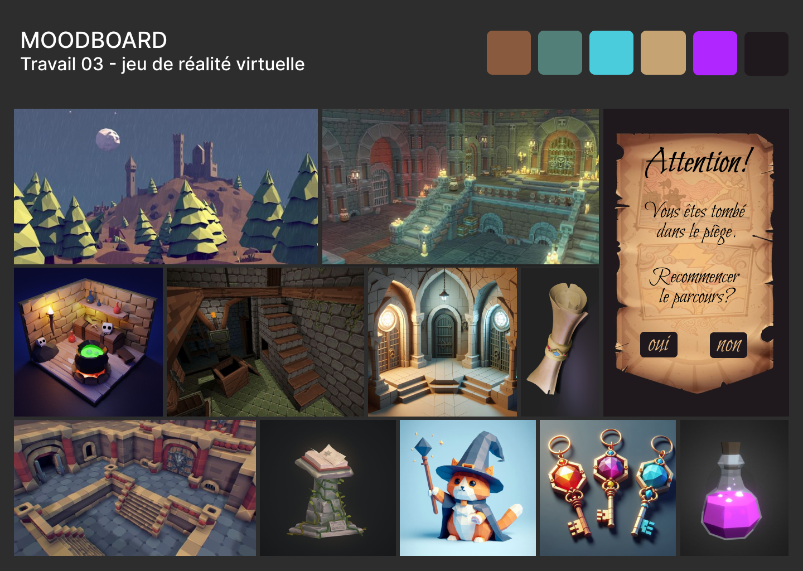

# VR_travail_03
## Résumé en une phrase
Le personnage principal doit sauver son chat en résolvant 3 puzzles dans 3 pièces différentes 
## Description

## Moodboard

### Visuel

### Sonore
- [Musique d'ambiance](https://michaelghelfi.bandcamp.com/track/rangers-cabin)
- [Indices du défi](https://pixabay.com/sound-effects/game-bonus-144751/)
- [Succès du défi](https://pixabay.com/sound-effects/level-up-4-243762/)
- [Échec du défi](https://pixabay.com/sound-effects/failure-drum-sound-effect-2-7184/)
- [Rire du sorcier](https://pixabay.com/sound-effects/evil-laugh-89423/)

## Carte environnement virtuel

## Schéma de programmation
