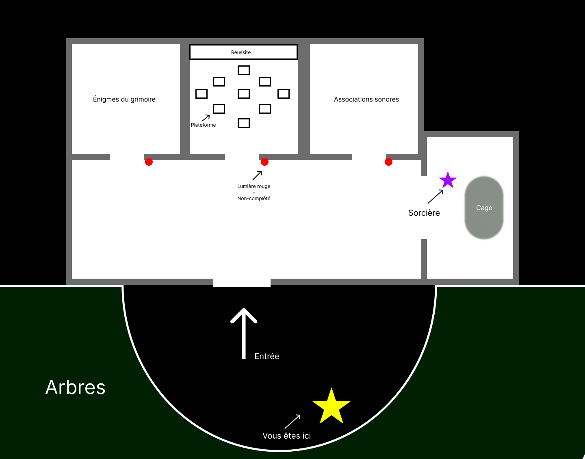
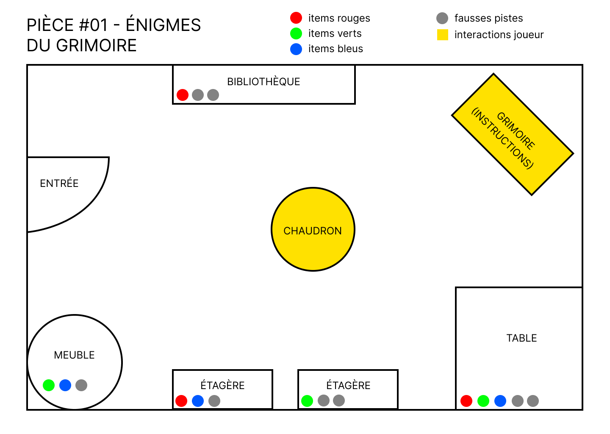
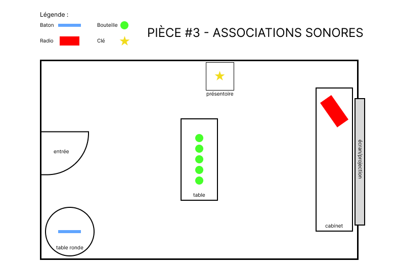
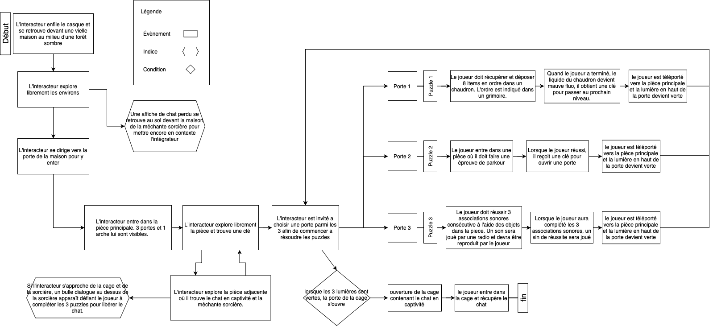
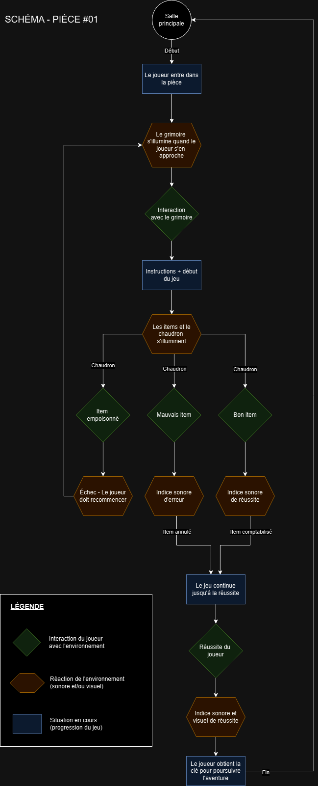

# Le chat et la sorcière
## Résumé en une phrase
*Le chat et la sorcière* est un jeu de type *Escape Room* où le joueur est invité à libérer son chat mis en captivité par une méchante sorcière en complétant 3 puzzles différents.

## Description
Un jeune étudiant cherche son chat disparu. Après avoir étudié sa disparition, il se retrouve devant une vieille maison perdue au milieu d'une forêt sombre. Lorsqu'il entre celle-ci, il explore les environs quand soudainement il voit dans la pièce adjacente son chat pris en captivité par une méchante sorcière. Il retourne à l'accueil et réalise qu'il y a trois portes, chacune menant à un puzzle à résoudre. Lorsque les trois puzzles seront complétés, le chat sera libéré de sa cage et la méchante sorcière sera vécue.

## Moodboard

### Visuel

### Sonore
- [Musique: Ambiance](https://michaelghelfi.bandcamp.com/track/rangers-cabin)
- [FX: Indices](https://pixabay.com/sound-effects/game-bonus-144751/)
- [FX: Succès](https://pixabay.com/sound-effects/level-up-4-243762/)
- [FX: Échec](https://pixabay.com/sound-effects/failure-drum-sound-effect-2-7184/)
- [FX: Rire maléfique](https://pixabay.com/sound-effects/witch-laughing-104760/)
- [FX: Bouteilles de verre](https://pixabay.com/sound-effects/glass-ding-33653/)

## Carte environnement virtuel
### Carte générale

### Pièce #01

### Pièce #03

## Schéma de programmation
### Schéma général

### Schéma détailé pièce #01

